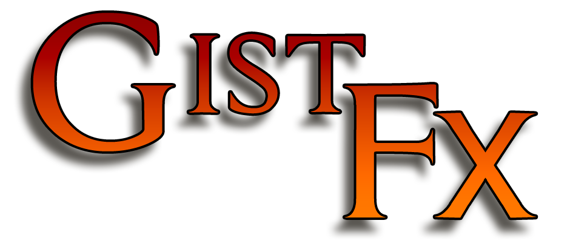

Forget using your default text editor application to jot down pieces of
code. Why not store these, instead, in a version controlled format?

GitHub Gists are a great way to store small code snippets, or even small
projects. GistFX provides a desktop Gist client, to make editing, creating, and
managing Gists a breeze.

### Features
- Built-in syntax highlighting for most  languages, using MonacoFX  - the same code editor used in Microsoft's open source Visual Studio
- Gists
    - Assign names to gists
    - Add / Delete Gists
- Gist Files
    - Add / Delete
    - Edit using feature rich MonacoFX Code Editor
    - Add / Edit descriptions
    - Move between Gists using drag and drop
- Share Gists
    - Send Gists to other users of GistFX via TCP/IP
    - Send Gists in groups when they are assigned to a category
    - Gist data is encrypted before being sent over the network
    - UPNP option available for easy router port re-direction
- Group Gists under categories
- Drag and drop Gists between categories
- Drag and drop files between Gists
- Navigate Gists and files from a TreeView
- Context-sensitive tree menus
- GitHub access token encrypted and saved locally, protected by password
- Detachable toolbar that is context dynamic (it only shows tools relevant to the task you're engaged in)
- Screen layout options
    - Wide mode for better visibility
    - Full screen mode with Menus
    - Distraction Free Mode - Just the code editor in full screen

### Coming soon
- Keyboard shortcuts for mouse free navigation
- Still working on Help content.
### Running GistFX

1. The fastest way to get up and running is to just download the latest installer from [this link](https://github.com/RedmondSims/GistFX/releases), or by clicking on the Release link at the right. Currently there are installers for Mac and Windows with Linux on the way.
2. You can also clone the project and if you have Maven and JavaFX 18 SDK installed, go into the POM file and change the paths to the icon files and do one of these:
      - ```mvn clean package```
      - ```mvn clean javafx:run```

### Getting Started

- Create a GitHub Personal Access Token for this application
  - This is far superior to user/pass authentication and is the only way GitHub allows access to your data.
    - Only gives GistFX the ability to access your Gists through the GitHub API.
      - The full instructions with screenshots are available when you run GistFX by clicking on the question mark at the login screen. OR
      - Create by [clicking here](https://github.com/settings/tokens/new)
      - Check ONE box - **Gist**


---

### On first run

You will first be shown a window that explains the need for an access token, this window only shows on the first run.

Next, you will be presented with a login screen, click on the question mark for detailed instructions for creating a proper access token.


Enter the GitHub personal access token that you created, along with a password that will be used to encrypt then locally store your personal access token.

---

Once you authenticate successfully to your GitHub account, your Gists are download and stored inside a SQLite database. The data is first encrypted before it is stored using your password. Then, any changes you make to your gists will be kept in the database until you upload them. Your changes are not uploaded to GitHub automatically, in order to reduce the number of version changes that accumulate in your Gists.

GistFX makes it very clear when you have data that needs to be committed to your GitHub account, and it will present you with an opportunity to commit those changes when you close the program or when you open the program if you have uncommitted data in the local database.

GistFX always compares the local copy of your Gists with your GitHub version each time you log into GistFX and will notify you of any discrepencies, should they exist.

See the Help menu for further discussion concerning the use and utility of GistFX. We think you will find this program to be very handy in the preservation of those code snippets that matter the most in your development endeavours. We not only develop this program, we use it regularly, so we do everything we can to make it a tool that is easy to use as a relevant addition to our arsenal of development tools.
